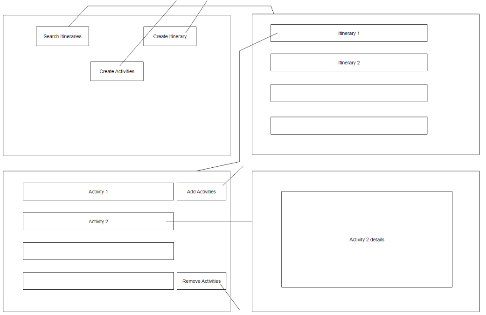

# _VACANZA_ Design Document


## 1. Problem Statement

Vacations can be difficult to plan, organize, and share with travel partners.
This app is designed to allow users to add activities to their own vacation itinerary. 
Users can search itineraries, view itineraries, add activities, store activities to itineraries, and search through activities to add to their itineraries.

As one travels and discovers more places and activities, it would be great to have one place to store it, 
as a record for future use for oneself and others.


## 2. Top Questions to Resolve in Review

1. How many tables will we need?
2. What level of detail do we want to display in our itinerary?
3. Would we like search for itineraries by title or by user?


## 3. Use Cases

U1. As a user, I want to be able to save a list of activities to do on a vacation.

U2. As a user, I want to view my itinerary when I search for it.

U3. As a user, I want to add activities to my itinerary after searching through them.

U4. As a user, I want to be able to see itineraries organized by title, by user and by city,

U5. As a user, I want to be able to search for activities by city, type, and other attributes.

U6. As a user, I want to be able to add items to the activities options.

_Extensions_

U7. As a user, I want to be able to add myself or remove myself as associated with an itinerary. 

U8. As a user, I want to be able to see my itineraries separately when logged in.


## 4. Project Scope

### 4.1. In Scope

1. Search/View for Itineraries
2. View Itineraries by city/title/user
3. Search for Activities
4. Add Activities
5. Add and Remove Activities to go to an itinerary

### 4.2. Out of Scope

1. Have an order to the itinerary
2. Know distances to and from places in itinerary
3. Have reviews/recommendations for places


# 5. Proposed Architecture Overview

Class Diagram here: 

# 6. API

## 6.1. Public Models

### 1. ItineraryModel
### 2. ActivityModel


## 6.2. _Endpoints_

### 6.1. Accepts GET Requests to search/view for a Itinerary
    Input: userId and title
    Output: Itinerary
### 6.2. Accepts GET Requests to search for activities
     Input: typeOfActivity or weatherPermitting or kidFriendly
     Output: List of Activities
### 6.3. Accepts POST Requests of creating an Itinerary
```
   Input: email  and title, city, List<Activity>, List<String> users
      Output: new Itinerary
```
### 6.4. Accepts POST Requests of adding Activities to the database
   ```
   Input: name and city/country,  address, typeOfActivity, kidFriendly, weatherPermitting
   Output: new Activity
```
### 6.5. Accepts POST Requests of adding Activities to an Itinerary
```
    Input: email/title, name/city,country
    itineraryID? activtiyID?
    Output: updated itinerary – list of activities (optional, though this is what our model does)
```
### 6.6. Accepts PUT Requests to remove Activities from List in Itinerary
   ```
    Input: email/title, name/city,country
    itineraryID? activtiyID?
    Output: itinerary (optional)
```

# 7. Tables
### 7.1`ACTIVITY`
```
String name // partition key
String city,country // sort key 
String address 
ENUM typeOfActivity
Boolean kidFriendly
Boolean weatherPermitting
```
-Alternative GSI:  use the type of activity as the partition key and the name as a sort key to query for all Skiing options, for example. Then a GSI which uses the partition key of city,country 
and the sort key of type for queries like Berlin dancing or Berlin thrifting, etc.

### 7.2 `ITINERARY`

```
String title  // sort key 
String email // partition key 
String city
List<Activities>
List<String> users
```
-Extension: GSI for partition key: city,country


# 8. Pages

